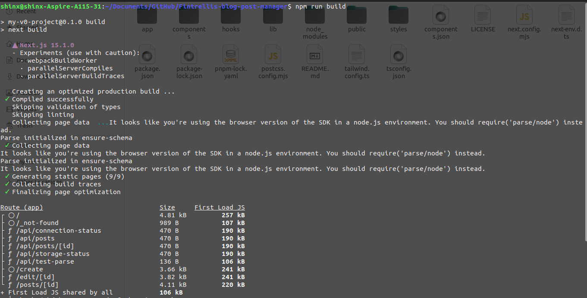
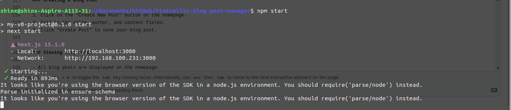
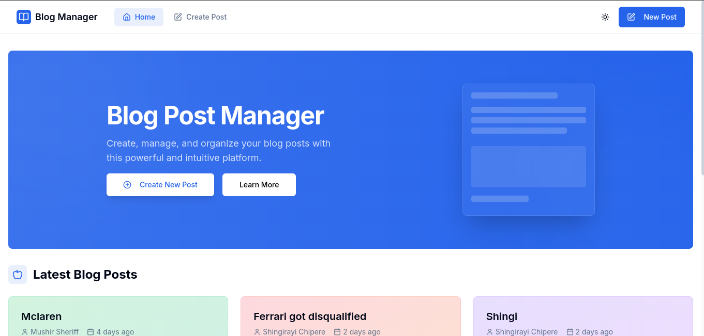
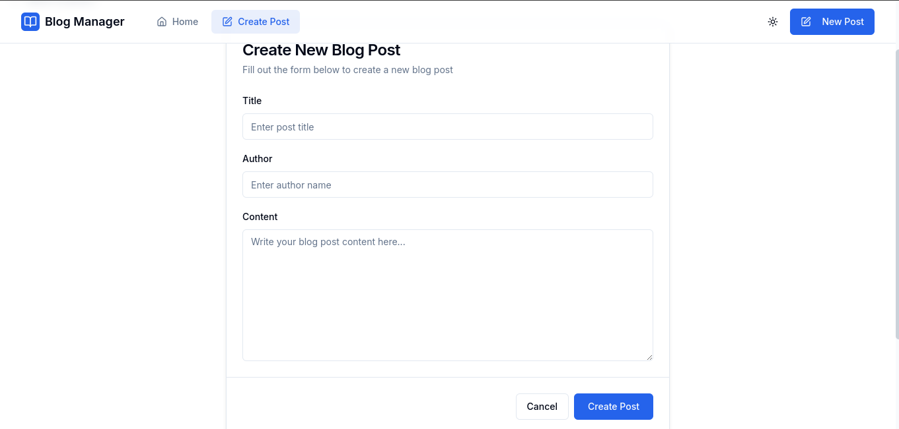
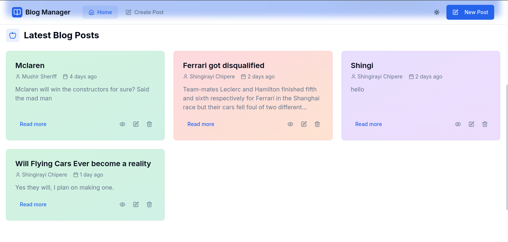
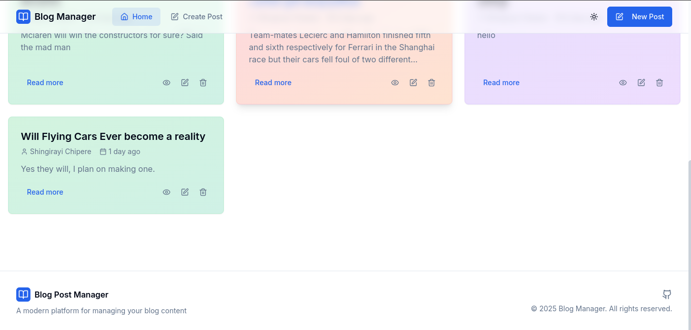
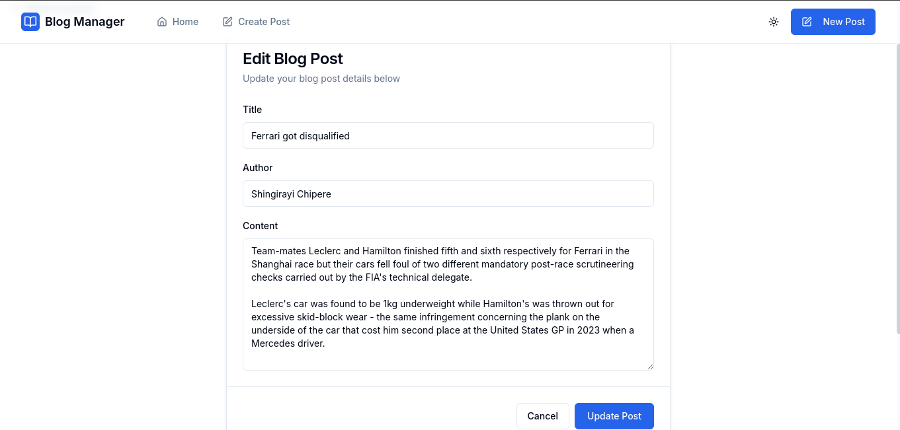
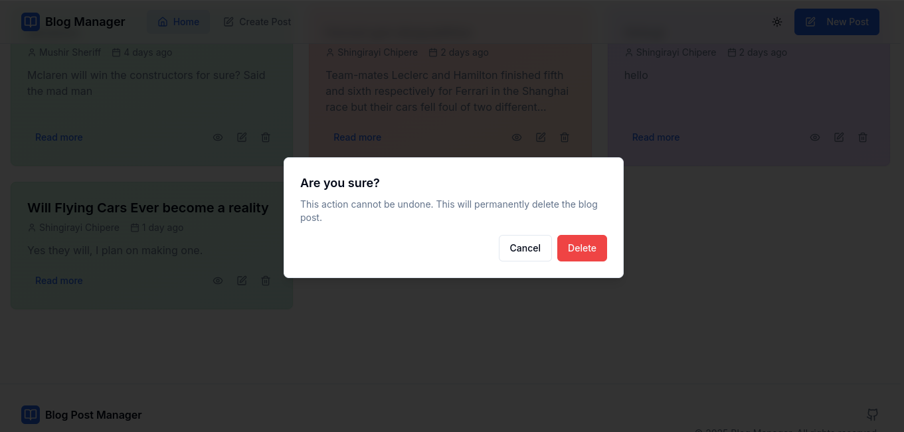

# Fintrellis-Limited-blogPost

A modern full-stack blog post management application built with Next.js, Tailwind CSS, and Back4App as the backend database.


## Features

- Create, read, update, and delete blog posts
- Modern, responsive UI with dark mode support
- Real-time data synchronization with Back4App
- Markdown content support
- User-friendly forms with validation
- Smooth animations and transitions
- Mobile-friendly design


## Table of Contents

- [Prerequisites](#prerequisites)
- [Installation](#installation)

- [Installing Node.js on Ubuntu 22.04](#installing-nodejs-on-ubuntu-2204)
- [Installing Node.js on Windows](#installing-nodejs-on-windows)


- [Project Setup](#project-setup)
- [Running the Application](#running-the-application)
- [Usage](#usage)
- [Troubleshooting](#troubleshooting)


## Prerequisites

Before you begin, ensure you have the following:

- Node.js (v18 or higher)
- npm (v9 or higher)


## Installation

### Installing Node.js on Ubuntu 22.04

1. Update your package index:


```shellscript
sudo apt update
```

2. Install Node.js and npm using the NodeSource repository:


```shellscript
# Install curl if not already installed
sudo apt install -y curl

# Add NodeSource repository (for Node.js 18)
curl -fsSL https://deb.nodesource.com/setup_18.x | sudo -E bash -

# Install Node.js and npm
sudo apt install -y nodejs
```

3. Verify the installation:


```shellscript
node --version
npm --version
```

4. If it didn't install try
```shellscript
npm install --force
npm install react-day-picker@8.10.1 --legacy-peer-deps
```
5. Install Back4app dependecies for the database
 ```shellscript
 npm install parse @react-native-async-storage/async-storage --force
 ```

### Installing Node.js on Windows

1. Download the Node.js installer from the [official website](https://nodejs.org/).

1. Choose the LTS (Long Term Support) version for better stability.


2. Run the installer and follow the installation wizard:

1. Accept the license agreement
2. Choose the installation location
3. Select the components to install (the defaults are usually fine)
4. Click "Install"


3. Verify the installation by opening Command Prompt or PowerShell and running:


```shellscript
node --version
npm --version
```

## Project Setup

1. Clone the repository or download the source code:


```shellscript
# If using Git
git clone https://github.com/yourusername/blog-post-manager.git
cd blog-post-manager

# If downloaded as a ZIP file
# Extract the ZIP file and navigate to the extracted folder
```

2. Install the project dependencies:


```shellscript
npm install
```


## Running the Application


1. Open your browser and navigate to [http://localhost:3000](http://localhost:3000)


For production deployment:




```shellscript
# Build the application
npm run build

# Start the production server
npm start
```


## Usage

### Creating a Blog Post


1. Click on the "Create New Post" button on the homepage.

2. Fill in the title, author, and content fields.
3. Click "Create Post" to save your blog post.


### Viewing Blog Posts

- All blog posts are displayed on the homepage.


- Click on a post card to view the full post.  



### Editing a Blog Post

1. Navigate to the blog post you want to edit.
2. Click the "Edit" button.
3. Make your changes in the form.
4. Click "Update Post" to save your changes.


### Deleting a Blog Post

1. Navigate to the blog post you want to delete.
2. Click the "Delete" button.
3. Confirm the deletion in the dialog that appears.



## Troubleshooting

### Connection Issues with Back4App

If you're experiencing connection issues with Back4App:

1. Verify your Application ID and JavaScript Key in the `.env.local` file.
2. Check your internet connection.
3. Ensure that your Back4App plan is active.
4. Check if the "BlogPost" class exists in your Back4App database.


### Application Not Starting

If the application fails to start:

#### Ubuntu:

```shellscript
# Check for Node.js and npm
node --version
npm --version

# Clear npm cache
npm cache clean --force

# Remove node_modules and reinstall
rm -rf node_modules
npm install
```

#### Windows:

```shellscript
# Check for Node.js and npm
node --version
npm --version

# Clear npm cache
npm cache clean --force

# Remove node_modules and reinstall
rmdir /s /q node_modules
npm install
```

### Other Issues

If you encounter any other issues:

1. Check the browser console for error messages.
2. Check the terminal where you're running the application for server-side errors.
3. Ensure all dependencies are installed correctly.
4. Try restarting the development server.


---

## License

This project is licensed under the MIT License - see the LICENSE file for details.

## Acknowledgements

- [Next.js](https://nextjs.org/)
- [Tailwind CSS](https://tailwindcss.com/)
- [shadcn/ui](https://ui.shadcn.com/)
- [Back4App](https://www.back4app.com/)
- [Framer Motion](https://www.framer.com/motion/) 
